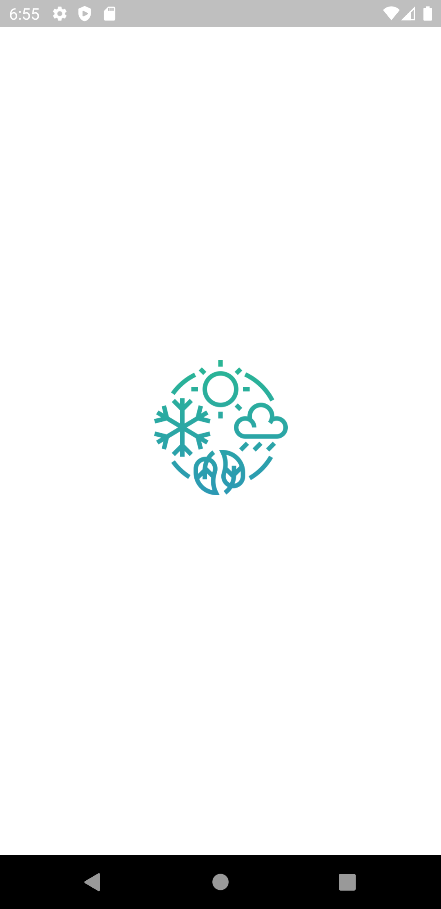
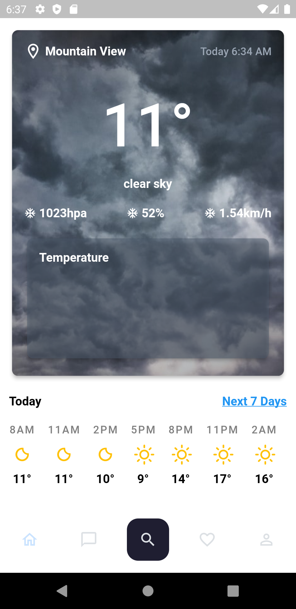

## Design credits belongs to [Hakim Haiman](https://dribbble.com/shots/17998271-Cuacane-Weather-App), so a big thanks for him.

## [App is not completed yet!!!]

# Weather - Weather App

A weather application made with #FLUTTER, allows users to know current weather and forecast.

### Weather App

<a href="https://www.linkedin.com/in/hossam-mohammad-9965791a8/"></a>
<a href="https://twitter.com/hossammo9996"></a>

## Flutter Packages

- Flutter_bloc
- intl
- dio
- internet_connection_checker
- dartz
- equatable
- get_it
- geolocator

<!--
-shared_preferences
-fluttertoast
-->

## Next Features

- Profile
- Chats
- Map
- Search by city
- add city to favorites

## Commands

```sh
    flutter pub upgrade
```

```
    flutter pub get
```

## Backend

- [openWeatherApi]

---

## Screenshots


<table border>
    <tr>
        <th style="text-align:center">Splash Screen</th>
        <th style="text-align:center">Home</th>
    </tr>
    <tr>
        <td></td>
        <td></td>
    <tr>
</table>

